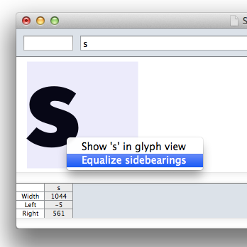

Equalize Sidebearings Key
=========================

A RoboFont extension that allows sidebearings to be equalized using a hotkey in
the Space Center.

The hotkey can be customised in the extension's preferences.

RoboFont provides an option to equalize a glyph's sidebearings via a contextual
menu item:

Because of the mouse precision required, the default method is much slower than
a keyboard equivalent.

This extension enables the same functionality to be triggered by a customisable
hotkey (which defaults to the `e` key):

(Font used in screenshots is [Fira Sans Bold](http://mozilla.github.io/Fira/).)

## Installation
Download the extension from the [releases
page](https://github.com/teddywing/RoboFont-Equalize-Sidebearings-Key/releases).
Double-click it to install.

## License
Licensed under the MIT license. See the included LICENSE file.
